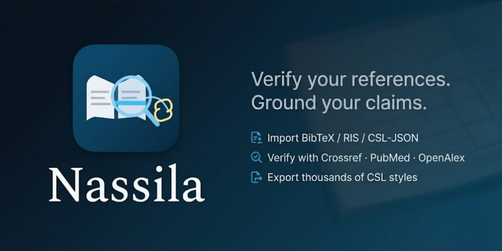

[](https://github.com/jamalesam93/Nassila/releases/latest)

# Nassila

**Nassila** (ناسيلا) is a Windows desktop app that helps you **clean and check a reference list before you submit** — not a full reference manager, but a quality pass on citations you already have.

*Verify your references. Ground your claims.*  
*The last check before you submit — bibliography, registries, and source-backed writing.*

Import or paste your bibliography, fix common errors, verify rows against Crossref / PubMed / OpenAlex, flag predatory journals, remove duplicates, and export in thousands of [CSL](https://citationstyles.org/) styles.

| | |
|---|---|
| **Download (Windows)** | [**Latest release**](https://github.com/jamalesam93/Nassila/releases/latest) — `Nassila Setup 1.0.1.exe` |
| **Documentation** | [How-to guide](docs/HOW_TO_GUIDE.md) · [User guide](docs/USER_GUIDE.md) · [Brand](docs/BRAND.md) · [Changelog](CHANGELOG.md) |
| **License** | [MIT](LICENSE) |

> End users: install from **Releases**. Developers: clone this repo and see [Getting started](#getting-started).

The name **Nassila** is coined, inspired by the idea of a **sanad** (سند): a clear chain from what you write to where it came from.

## Who is this for?

- Students and researchers preparing a thesis or manuscript reference list  
- Anyone exporting from **Zotero**, **Mendeley**, or **EndNote** who wants validation and registry checks before submission  
- Editors who need a quick **predatory-journal** screen and **duplicate** detection on a batch of references  

## What it does

1. **Import or paste** — BibTeX, RIS, CSL-JSON, plain text, DOCX/PDF reference sections, or manager exports  
2. **Validate** — missing fields and style-specific issues (works offline)  
3. **Autocorrect** — DOI formats, capitalization, page ranges, medRxiv/bioRxiv DOI canonicalization, and more  
4. **Verify references** — one action: resolve each row to Crossref, PubMed, or OpenAlex (**L1**), then compare your metadata to the canonical record (**L2**), with safe auto-patches when registries agree (up to **200** prioritized rows per run)  
5. **Predatory journal scan** — match journal titles against bundled and updatable predatory/pseudo-journal lists  
6. **Deduplicate** and **export** — formatted bibliography in APA, IEEE, Vancouver, Chicago, Harvard, MLA, Nature (bundled), or any style from the [Zotero CSL repository](https://github.com/citation-style-language/styles)  
7. **Manuscript loop (Ouroboros)** — upload or paste a manuscript, verify cited references (L1/L2), fetch open-access source text where available, and run **Sanad** passage grounding (L3) with a local LLM — see the [user guide](docs/USER_GUIDE.md)

**Privacy:** list editing and validation work offline. Registry verification, DOI lookup, predatory-list sync, and manuscript source fetch use the network only when you run those actions.

## Highlights

| Area | Capability |
|------|------------|
| Parsing | BibTeX, RIS, CSL-JSON, plain text, URL-only webpages, DOCX/PDF reference extraction |
| Resolution | DOI, ISBN, PMID, URL → Crossref, PubMed, Open Library |
| Verification | Unified L1+L2 registry check, up to 200 rows per run |
| Integrity | Predatory/suspicious journal flags, duplicate groups with merge |
| Manuscript | Ouroboros loop: L1/L2 verify, OA source fetch, Sanad L3 grounding |
| Output | CSL formatting, undo/redo, dark/light mode, EN/AR UI |

## Getting started

### Prerequisites

- Node.js 18+
- npm 9+

### Install and run locally

```bash
npm install
npm run dev
```

### Build the Windows installer

```bash
npm run icon:raster   # once: generates build/icon.png
npm run build
npm run build:win     # → dist/Nassila Setup <version>.exe
```

Other targets: `npm run build:mac`, `npm run build:linux`, `npm run build:unpack` (unpacked Windows folder for testing).

### Tests

```bash
npm test
```

### How-to guide

See [docs/HOW_TO_GUIDE.md](docs/HOW_TO_GUIDE.md).

## Tech stack

Electron · React 19 · TypeScript · Tailwind · citeproc-js · Zustand · Vitest
