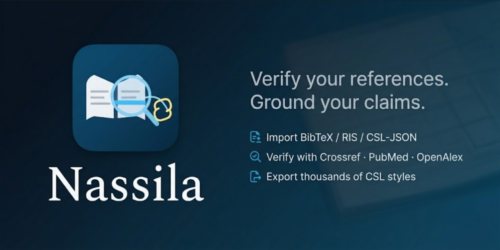

[](https://github.com/jamalesam93/Nassila/releases/latest)

# Nassila

**Nassila** (ناسيلا) is a Windows desktop app that helps you **clean and check a reference list before you submit** — not a full reference manager, but a quality pass on citations you already have.

*Verify your references. Ground your claims.*  
*The last check before you submit — bibliography, registries, and source-backed writing.*

Import or paste your bibliography, fix common errors, verify rows against Crossref / PubMed / OpenAlex, flag predatory journals, remove duplicates, and export in thousands of [CSL](https://citationstyles.org/) styles.

| | |
|---|---|
| **Download (Windows)** | [**v1.8.0**](https://github.com/jamalesam93/Nassila/releases/tag/v1.8.0) · [Latest release](https://github.com/jamalesam93/Nassila/releases/latest) |
| **Sanad model (HF)** | [`nassila-sanad-9b`](https://huggingface.co/QinEmPeRoR93/nassila-sanad-9b) — setup on the [website](https://nassila-web.vercel.app/en/docs/manuscript) |
| **Website & docs** | [nassila-web.vercel.app](https://nassila-web.vercel.app) — [How-to](https://nassila-web.vercel.app/en/docs/how-to) · [User guide](https://nassila-web.vercel.app/en/docs/user-guide) · [Changelog](https://nassila-web.vercel.app/en/changelog) |
| **Documentation (repo)** | [How-to guide](docs/HOW_TO_GUIDE.md) · [User guide](docs/USER_GUIDE.md) · [Brand](docs/BRAND.md) · [Changelog](CHANGELOG.md) |
| **License** | [MIT](LICENSE) |

> End users: install from **Releases** ([**v1.8.0**](https://github.com/jamalesam93/Nassila/releases/tag/v1.8.0)) or visit the [**website**](https://nassila-web.vercel.app). Developers: clone this repo and see [Getting started](#getting-started).

The name **Nassila** is coined, inspired by the idea of a **sanad** (سند): a clear chain from what you write to where it came from.

## What's new in v1.8.0 — Sanad 9B

- **Sole-tier Sanad registry** — `nassila-sanad-9b` (9B FT-5) is the only Sanad tier: single 9B tier chip, setup modal / presets / hints / defaults all point at the 9B model. 4B S15 / 12B S14 / E4B retired (abstract-era); stored retired model ids fall back to generic local-model behavior while grounding still works.
- **Qwen3.5 thinking handling** — `stripQwenThinkingTraces` runs first in the grounding JSON repair pipeline, so thinking-wrapped model output (with braces/quotes inside the reasoning) parses identically to clean JSON, and clean output passes through byte-identical.
- **Token budget** — `max_tokens: 2048` on Sanad 9B grounding calls prevents mid-JSON truncation from thinking traces.
- **No-thinking template on the web** — the `--chat-template-file` template for llama.cpp users lives in the [Sanad setup guide](https://nassila-web.vercel.app/en/docs/sanad-setup); the Custom provider preset links there.

Full notes: [CHANGELOG.md](CHANGELOG.md) · [v1.8.0 release](https://github.com/jamalesam93/Nassila/releases/tag/v1.8.0).

## Who is this for?

- Students and researchers preparing a thesis or manuscript reference list  
- Anyone exporting from **Zotero**, **Mendeley**, or **EndNote** who wants validation and registry checks before submission  
- Editors who need a quick **predatory-journal** screen and **duplicate** detection on a batch of references  

## What it does

1. **Import or paste** — BibTeX, RIS, CSL-JSON, plain text, DOCX/PDF reference sections, or manager exports  
2. **Validate** — missing fields and style-specific issues (works offline)  
3. **Autocorrect** — DOI formats, capitalization, page ranges, medRxiv/bioRxiv DOI canonicalization, and more  
4. **Verify references** — one action: resolve each row to Crossref, PubMed, or OpenAlex (**L1**), then compare your metadata to the canonical record (**L2**), with safe auto-patches when registries agree (up to **200** prioritized rows per run)  
5. **Predatory journal scan** — match journal titles against bundled and updatable predatory/pseudo-journal lists  
6. **Deduplicate** and **export** — formatted bibliography in APA, IEEE, Vancouver, Chicago, Harvard, MLA, Nature (bundled), or any style from the [Zotero CSL repository](https://github.com/citation-style-language/styles)  
7. **Manuscript loop (Ouroboros)** — upload or paste a manuscript, verify cited references (L1/L2), fetch open-access source text where available, and optional **Sanad** passage grounding (L3) — [manuscript guide](https://nassila-web.vercel.app/en/docs/manuscript)

**Privacy:** list editing and validation work offline. Registry verification, DOI lookup, predatory-list sync, and manuscript source fetch use the network only when you run those actions.

## Highlights

| Area | Capability |
|------|------------|
| Parsing | BibTeX, RIS, CSL-JSON, plain text, URL-only webpages, DOCX/PDF reference extraction (PDF uses fast Rust WASM parser with Markdown tables & column layout) |
| Resolution | DOI, ISBN, PMID, URL → Crossref, PubMed, Open Library |
| Verification | Unified L1+L2 registry check (main-process IPC in packaged app), up to 200 rows per run |
| Integrity | Predatory/suspicious journal flags, duplicate groups with merge |
| Manuscript | Ouroboros loop: L1/L2 verify, OA source fetch, per-source PDF attach + single-ref re-audit, optional Sanad L3 ([HF model](https://huggingface.co/QinEmPeRoR93/nassila-sanad-9b)) |
| Output | CSL formatting, undo/redo, dark/light mode, EN/AR UI |

## Getting started

### Prerequisites

- Node.js 18+
- npm 9+

### Install and run locally

```bash
npm install
npm run dev
```

### Build the Windows installer

```bash
npm run icon:raster   # once: generates build/icon.png
npm run build
npm run build:win     # → dist/Nassila Setup <version>.exe
```

Other targets: `npm run build:mac`, `npm run build:linux`, `npm run build:unpack` (unpacked Windows folder for testing).

### Tests

```bash
npm test
```

## Tech stack

Electron · React 19 · TypeScript · Tailwind · citeproc-js · Zustand · Vitest

## Open-source acknowledgments

Nassila is built on top of incredible open-source tools, libraries, and specifications:

| Project | Role in Nassila | License |
|---------|-----------------|---------|
| [**pdf-inspector**](https://github.com/firecrawl/pdf-inspector) | Fast Rust PDF classification, layout recovery, and Markdown text/table extraction (Maktab Tier A) | MIT |
| [**citeproc-js**](https://github.com/juris-m/citeproc-js) | CSL citation formatting engine powering APA, IEEE, Vancouver, Chicago, and custom styles | AGPL-2.0 / CPAL-1.0 |
| [**Tesseract.js**](https://github.com/naptha/tesseract.js) | Pure JS OCR engine for offline document scan text extraction (Maktab Tier B) | Apache-2.0 |
| [**PDF.js**](https://github.com/mozilla/pdf.js) | Fallback PDF rendering and text content extraction | Apache-2.0 |
| [**Citation-js**](https://github.com/citation-js/citation-js) | Parsing BibTeX, RIS, and CSL-JSON reference formats | MIT |
| [**Mammoth**](https://github.com/mwilliamson/mammoth.js) | Converting DOCX manuscript documents for reference section ingest | BSD-2-Clause |
| [**CSL Styles**](https://github.com/citation-style-language/styles) | Citation Style Language (CSL) repository powering 10,000+ academic styles | CC-BY-SA 3.0 |
