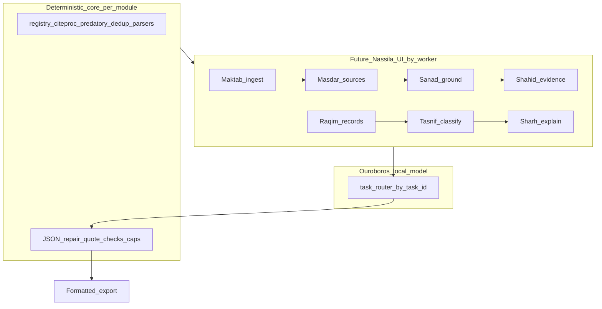

# Nassila Ouroboros — local model strategy

Long-term vision for Nassila’s **local AI** and **post–references-tab UI**: one model identity (one LM Studio slot, one download story) refined over time. The app routes requests to **seven workers** — each a **product module** with a deterministic core plus an optional trainable LLM facet. **v1 trains only the first worker facet: Sanad** (`l3_grounding`); v1.4a is an **adapter checkpoint**, not product ship (see [`OUROBOROS_CONTEXT.md` §5](./OUROBOROS_CONTEXT.md)).

This is a **north star**, not a v1 scope promise.

---

## What Ouroboros means

Workers are **future app modules**, not sidecar LLM tricks. Registry verification, citeproc, predatory lists, dedup, and import parsers stay **authoritative and deterministic** — they **belong inside worker modules** (especially Raqim and Tasnif), not outside Ouroboros.

| Worker module | Deterministic core (stays) | LLM facet (forge when ready) |
|---------------|---------------------------|------------------------------|
| **Sanad** | JSON repair, quote checks | `l3_grounding` — **checkpoint** (v1.4a adapter) |
| **Maktab** | File I/O, ingest routing | `doc_extract` |
| **Masdar** | OA fetch, chunking | `source_pdf_extract` |
| **Shahid** | Region detection (future) | `table_figure_grounding` |
| **Raqim** | L1/L2 verify, import parsers, citeproc export | `webpage_metadata` |
| **Tasnif** | Predatory lists, dedup, type rules | `webpage_classify` |
| **Sharh** | Mismatch copy, i18n | `issue_explain` |

The model **assists**; deterministic layers **decide** where APIs and schemas are authoritative.

**Today:** deterministic cores live under `src/engine/`; shipping UI is still references-tab-centric. **When Ouroboros is complete:** UI reshaped from scratch around worker flows; engine code reorganized under module boundaries.

**Agent brief:** [`OUROBOROS_CONTEXT.md`](./OUROBOROS_CONTEXT.md).

## Seven pillars (product architecture)

These describe the full Nassila academic loop. **Every pillar maps to one or more worker modules** (§3 in [`OUROBOROS_CONTEXT.md`](./OUROBOROS_CONTEXT.md)). Pillars without a dedicated LLM facet today still ship via **deterministic core** inside those modules.

| # | Pillar | Primary workers | Notes |
|---|--------|-----------------|-------|
| 1 | **Scraping** | Maktab, Masdar, Raqim | Ingest, OA sources, webpage capture |
| 2 | **Analyzing** | Sanad, Tasnif, Shahid | Passage vs excerpt, typing, multimodal evidence |
| 3 | **Thinking** | Sanad, Shahid | Bounded verdict + quote reasoning — not open-ended thesis generation |
| 4 | **Structuring** | Raqim | CSL records, manuscript hierarchy, **citeproc export** |
| 5 | **Drafting** | — | Out of scope for Sanad v1; optional cloud later |
| 6 | **Aligning** | Sanad, Sharh, Tasnif | Schema, repair, explain mismatches, predatory/dedup alignment |
| 7 | **Refining** | Sharh, Raqim | i18n, user-facing polish, formatted bibliography |

Rules **1, 6, and 7** are especially critical on desktop: secure ingest, deterministic alignment, and rendered output quality.

## Workers registry

Stable **`task`** ids in JSONL and code. Seven workers = seven future modules; forge **one LLM facet at a time**. **Agent brief:** [`OUROBOROS_CONTEXT.md`](./OUROBOROS_CONTEXT.md).

| task id | Codename | Module role | LLM facet status | Engine hook (today) |
|---------|----------|-------------|------------------|---------------------|
| `l3_grounding` | **Sanad** (سند) | Ground claims to sources | **Tier 2 PASS** (12B Q6_K v1.10 optional); E4B default | [`grounding-llm.ts`](../src/engine/manuscript/grounding-llm.ts) |
| `doc_extract` | **Maktab** (مكتب) | Manuscript ingest | Planned | [`pdf-extract.ts`](../src/engine/manuscript/pdf-extract.ts) |
| `source_pdf_extract` | **Masdar** (مصدر) | Cited source text | Planned | Manuscript audit |
| `table_figure_grounding` | **Shahid** (شاهد) | Table/figure evidence | Planned (12B) | Multimodal |
| `webpage_metadata` | **Raqim** (رقيم) | Reference records + verify + export | Planned | [`WEBPAGE_ROADMAP.md`](./WEBPAGE_ROADMAP.md), verifier, citeproc |
| `webpage_classify` | **Tasnif** (تصنيف) | Type, dedupe, predatory | Planned | Predatory, dedup |
| `issue_explain` | **Sharh** (شرح) | User-facing explanations | Planned | Fetch / paywall errors |

Constants: [`src/shared/nassila-agent-tasks.ts`](../src/shared/nassila-agent-tasks.ts).  
Training pack: [`TRAINING.md`](./TRAINING.md) → [NassilaT `training/`](https://github.com/jamalesam93/NassilaT/tree/main/training).

---

## Worker Sanad (v1)

**Sanad** (`l3_grounding`): manuscript passage vs source excerpt → structured JSON claims (`supported`, `weak`, `contradicted`, `not_in_source`, `insufficient_evidence`) with verbatim `sourceQuotes` when supported.

- **Base model:** Gemma 4 E4B (`google/gemma-4-E4B-it`)
- **Checkpoint adapter:** `nassila-grounding-e4b-v1.4a` (HF; best of v1.4 cycle)
- **Excerpt type (train/eval v1.x):** **abstract-only**; app may pass longer chunks up to 4200 chars at inference ([`grounding-llm.ts`](../src/engine/manuscript/grounding-llm.ts))
- **Product ship:** requires Tier 2 (abstract harness §10) then Tier 3 (Masdar + full-text eval) — see [`OUROBOROS_CONTEXT.md` §5, §10](./OUROBOROS_CONTEXT.md)

---

## Model artifacts (naming)

| Stage | Artifact | Base | Notes |
|-------|----------|------|-------|
| **Sanad default** | `nassila-sanad-e4b` | E4B | Q6_K ~8 GB; checkpoint on model card only |
| **Sanad optional** | `nassila-sanad-12b` | 12B | Q6_K; checkpoint v1.10 on card |
| **Merged Ouroboros (future)** | `nassila-agent-e12b-v1` | 12B+ | Multi-worker + multimodal when ready |

**Rule:** Prefer **one GGUF in LM Studio** with task routing. Separate adapters per worker during R&D; merge before marketing a unified Ouroboros bundle.

**Dual-tier policy (A/B pilot — recorded June 2026):**

| Tier | Base | Quant | Combined (115-row) | Tier 2 §10 | Role |
|------|------|-------|-------------------|------------|------|
| **Default** | Gemma 4 E4B | Q6_K (~8GB-friendly) | 88.12% (v1.10) | FAIL | Sanad + text workers; continue E4B iteration |
| **Optional quality** | Gemma 4 12B | **Q6_K** (sweet spot) | **94.79%** (v1.10) | **PASS** | First Tier-2-passing Sanad checkpoint; optional download |
| Shahid (future) | Gemma 4 12B | Q4–Q8 ladder | — | — | Multimodal worker |

E4B remains the **default** LM Studio download (`nassila-sanad-e4b-q6_k.gguf`). **`nassila-sanad-12b-q6_k.gguf`** (checkpoint v1.10) is the optional high-accuracy Sanad tier — passes all six Tier 2 model gates on the hardened harness (quote validity 100%, false-supported 2.82%).

The automated A/B script (`compare_ab_pilot.py`) still reports `defer_12b_to_shahid_only` because **`multi_claim` holdout pass = 69.23%** (threshold 80%) — persistent misses on h-043, h-045, h-088. That sub-gate is stricter than Tier 2 ship; dual-tier adoption treats it as a known limitation, not a blocker for the optional tier.

Full walkthrough + HF upload: [NassilaT `PHASE2_9_AB_PILOT_WALKTHROUGH.md`](https://github.com/jamalesam93/NassilaT/blob/main/training/PHASE2_9_AB_PILOT_WALKTHROUGH.md).

---

## Training strategy

1. **Forge one worker at a time** — train/eval each `task` with its own JSONL and go/no-go.
2. **Shared discipline** — JSON strictness, eval harness, system + user chat template alignment.
3. **Merge when ready** — multi-task JSONL → single `nassila-agent-*` GGUF.
4. **Eval on Vast before home download** — bandwidth-saving workflow for GGUF.

---

## Distribution

- Do **not** bundle multi-GB GGUF in the installer.
- Host on **Hugging Face** (GGUF public; adapters optional).
- **Bring your own file** or in-app resumable download ([`BRAND.md`](./BRAND.md)).

---

## Deprecated name

**One Ring** was the earlier name for this strategy; the canonical name is now **Ouroboros** (this document).

---

## Related docs

| Doc | Role |
|-----|------|
| [`TRAINING.md`](./TRAINING.md) | **Training redirect** — all corpus/QLoRA/Vast work in NassilaT |
| [`OUROBOROS_CONTEXT.md`](./OUROBOROS_CONTEXT.md) | **Agent entry point** — workers, tiered ship gates, v1.5 planning |
| [`training/ROADMAP.md`](https://github.com/jamalesam93/NassilaT/blob/main/training/ROADMAP.md) | Training phases (NassilaT) |
| [`WEBPAGE_ROADMAP.md`](./WEBPAGE_ROADMAP.md) | Webpage + app work |
| [`BRAND.md`](./BRAND.md) | Product naming (sanad framing) |
