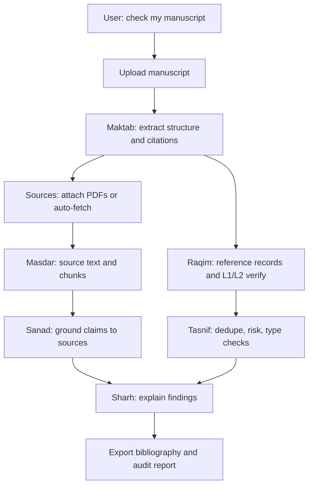
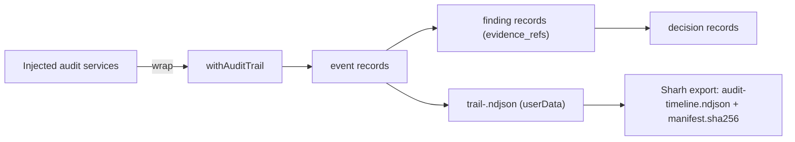

# Nassila Ouroboros — local model strategy

Long-term vision for Nassila’s **local AI** and **post–references-tab UI**: one model identity (one LM Studio slot, one download story) refined over time. The app routes requests to **seven workers** — each a **loop stage** and code module with a deterministic core plus an optional trainable LLM facet. **v1 trains only the first worker facet: Sanad** (`l3_grounding`); v1.4a is an **adapter checkpoint**, not product ship (see [`OUROBOROS_CONTEXT.md` §5](./OUROBOROS_CONTEXT.md)).

This is a **north star**, not a v1 scope promise.

---

## What Ouroboros means

**Ouroboros, not Hydra.** One snake eating its tail — a **closed loop** where workers complete each other. The user uploads a manuscript, the app resolves or accepts cited sources, audits claims and references, explains issues, and exports. **Hydra** is the anti-pattern: seven visible “heads” (peer worker tabs) that force the user to choose a destination and manually connect the workflow.

Workers are **stages in that loop** and **engineering modules**, not sidecar LLM tricks. Registry verification, citeproc, predatory lists, dedup, and import parsers stay **authoritative and deterministic** — they **belong inside worker modules** (especially Raqim and Tasnif), not outside Ouroboros.

| Worker module | Deterministic core (stays) | LLM facet (forge when ready) |
|---------------|---------------------------|------------------------------|
| **Sanad** | JSON repair, quote checks | `l3_grounding` — **checkpoint** (v1.4a adapter) |
| **Maktab** | File I/O, ingest routing | `doc_extract` |
| **Masdar** | OA fetch, chunking | `source_pdf_extract` |
| **Shahid** | Region detection (future) | `table_figure_grounding` |
| **Raqim** | L1/L2 verify, import parsers, citeproc export | `webpage_metadata` |
| **Tasnif** | Predatory lists, dedup, type rules | `webpage_classify` |
| **Sharh** | Mismatch copy, i18n | `issue_explain` |

The model **assists**; deterministic layers **decide** where APIs and schemas are authoritative.

```mermaid
flowchart TD
  userGoal["User: check my manuscript"] --> uploadManuscript["Upload manuscript"]
  uploadManuscript --> maktab["Maktab: extract structure and citations"]
  maktab --> sourceChoice["Sources: attach PDFs or auto-fetch"]
  sourceChoice --> masdar["Masdar: source text and chunks"]
  maktab --> raqim["Raqim: reference records and L1/L2 verify"]
  raqim --> tasnif["Tasnif: dedupe, risk, type checks"]
  masdar --> sanad["Sanad: ground claims to sources"]
  sanad --> sharh["Sharh: explain findings"]
  tasnif --> sharh
  sharh --> exportResult["Export bibliography and audit report"]
```

**Today:** the **Manuscript loop** ships via `OuroborosLoopWorkspace` (upload → audit → per-cite L1/L2/L3). Deterministic Maktab extraction and Masdar-lite OA source extraction are live under `src/engine/`, including per-reference local-PDF attach; their LLM facets remain planned. A **seven-item worker nav** may still appear as **transitional scaffolding** — not the end-state IA (see [`PRODUCT.md`](./PRODUCT.md)). **When Ouroboros is complete:** the remaining planned facets and Shahid become automatic pipeline stages; engine code stays organized under module boundaries.

**Agent brief:** [`OUROBOROS_CONTEXT.md`](./OUROBOROS_CONTEXT.md).

## Seven pillars (product architecture)

These describe the full Nassila academic loop. **Every pillar maps to one or more worker modules** (§3 in [`OUROBOROS_CONTEXT.md`](./OUROBOROS_CONTEXT.md)). Pillars without a dedicated LLM facet today still ship via **deterministic core** inside those modules.

| # | Pillar | Primary workers | Notes |
|---|--------|-----------------|-------|
| 1 | **Scraping** | Maktab, Masdar, Raqim | Ingest, OA sources, webpage capture |
| 2 | **Analyzing** | Sanad, Tasnif, Shahid | Passage vs excerpt, typing, multimodal evidence |
| 3 | **Thinking** | Sanad, Shahid | Bounded verdict + quote reasoning — not open-ended thesis generation |
| 4 | **Structuring** | Raqim | CSL records, manuscript hierarchy, **citeproc export** |
| 5 | **Drafting** | — | Out of scope for Sanad v1; optional cloud later |
| 6 | **Aligning** | Sanad, Sharh, Tasnif | Schema, repair, explain mismatches, predatory/dedup alignment |
| 7 | **Refining** | Sharh, Raqim | i18n, user-facing polish, formatted bibliography |

Rules **1, 6, and 7** are especially critical on desktop: secure ingest, deterministic alignment, and rendered output quality.

## Workers registry

Stable **`task`** ids in JSONL and code. Seven workers = seven loop stages / code modules; forge **one LLM facet at a time**. **Agent brief:** [`OUROBOROS_CONTEXT.md`](./OUROBOROS_CONTEXT.md).

| task id | Codename | Module role | LLM facet status | Engine hook (today) |
|---------|----------|-------------|------------------|---------------------|
| `l3_grounding` | **Sanad** (سند) | Ground claims to sources | **E4B S12** default-tier; **12B S14** quality tier | [`grounding-llm.ts`](../src/engine/manuscript/grounding-llm.ts) |
| `doc_extract` | **Maktab** (مكتب) | Manuscript ingest | Planned | [`maktab/extract.ts`](../src/engine/maktab/extract.ts), [`pdf-extract.ts`](../src/engine/manuscript/pdf-extract.ts) |
| `source_pdf_extract` | **Masdar** (مصدر) | Cited source text | Planned | Manuscript audit |
| `table_figure_grounding` | **Shahid** (شاهد) | Table/figure evidence | Planned (12B) | Multimodal |
| `webpage_metadata` | **Raqim** (رقيم) | Reference records + verify + export | Planned | [`WEBPAGE_ROADMAP.md`](./WEBPAGE_ROADMAP.md), verifier, citeproc |
| `webpage_classify` | **Tasnif** (تصنيف) | Type, dedupe, predatory | Planned | Predatory, dedup |
| `issue_explain` | **Sharh** (شرح) | User-facing explanations | Planned | Fetch / paywall errors |

Constants: [`src/shared/nassila-agent-tasks.ts`](../src/shared/nassila-agent-tasks.ts).  
Training pack: [`TRAINING.md`](./TRAINING.md) → [NassilaT `training/`](https://github.com/jamalesam93/NassilaT/tree/main/training).

---

## Worker Sanad (v1)

**Sanad** (`l3_grounding`): manuscript passage vs source excerpt → structured JSON claims (`supported`, `weak`, `contradicted`, `not_in_source`, `insufficient_evidence`) with verbatim `sourceQuotes` when supported.

- **Base model (default):** Qwen 3.5 4B (`Qwen/Qwen3.5-4B`) — checkpoint **S15**; legacy E4B (`gemma-4-E4B-it`) retired
- **Checkpoint adapter:** `nassila-grounding-e4b-v1.4a` (HF; best of v1.4 cycle)
- **Excerpt type (train/eval v1.x):** **abstract-only**; app may pass longer chunks up to 4200 chars at inference ([`grounding-llm.ts`](../src/engine/manuscript/grounding-llm.ts))
- **Product ship:** requires Tier 2 (abstract harness §10) then Tier 3 (Masdar + full-text eval) — see [`OUROBOROS_CONTEXT.md` §5, §10](./OUROBOROS_CONTEXT.md)

---

## Model artifacts (naming)

| Stage | Artifact | Base | Notes |
|-------|----------|------|-------|
| **Sanad default** | `nassila-sanad-4b` | Qwen 3.5 4B | Q6_K ~3.3 GB; **checkpoint S15** on model card |
| **Sanad optional** | `nassila-sanad-12b` | Gemma 4 12B | Q6_K; **checkpoint S14** on model card |
| **Merged Ouroboros (future)** | `nassila-agent-e12b-v1` | 12B+ | Multi-worker + multimodal when ready |

**Rule:** Prefer **one GGUF in LM Studio** with task routing. Separate adapters per worker during R&D; merge before marketing a unified Ouroboros bundle.

**Dual-tier policy (recorded June 2026; default tier updated to 4B Aug 2026):**

| Tier | Base | Quant | Eval | Verdict | Role |
|------|------|-------|------|---------|------|
| **Default** | Qwen 3.5 4B | Q6_K (~3.3 GB) | 94.48% combined expect / 4.87% false-sup on `eval_holdout_body_contrastive_frozen_v2` (S15) | Default-tier PASS (quote pending local verify) | Sanad default ship |
| **Quality** | Gemma 4 12B | Q6_K | **90.43%** combined (S14) | **Tier 2 PASS** | Selected quality tier; v1.12 12B = 94.20% fallback |
| Shahid (future) | Gemma 4 12B | Q4–Q8 ladder | — | — | Multimodal worker |

**E4B (`nassila-sanad-e4b`, S12) is retired** as default — the app ships `nassila-sanad-4b` (Qwen 3.5 4B, **S15**). 4B is the **default** LM Studio download. **`nassila-sanad-12b-q6_k.gguf`** (**checkpoint S14**) is the quality tier — Tier 2 PASS with h-045/h-088 fixed (multi_claim 84.62%). v1.12 12B remains higher-combined fallback. Validate locally via NassilaT [`LAPTOP_SMOKE_TEST.md`](https://github.com/jamalesam93/NassilaT/blob/main/training/LAPTOP_SMOKE_TEST.md).

Full walkthrough + HF upload: [NassilaT `PHASE2_9_AB_PILOT_WALKTHROUGH.md`](https://github.com/jamalesam93/NassilaT/blob/main/training/PHASE2_9_AB_PILOT_WALKTHROUGH.md).

---

## Training strategy

1. **Forge one worker at a time** — train/eval each `task` with its own JSONL and go/no-go.
2. **Shared discipline** — JSON strictness, eval harness, system + user chat template alignment.
3. **Merge when ready** — multi-task JSONL → single `nassila-agent-*` GGUF.
4. **Eval on Vast before home download** — bandwidth-saving workflow for GGUF.

---

## Distribution

- Do **not** bundle multi-GB GGUF in the installer.
- Host on **Hugging Face** (GGUF public; adapters optional).
- **Bring your own file** or in-app resumable download ([`BRAND.md`](./BRAND.md)).

---

## Agent patterns: provenance, memory, hardening

Design contract for borrowing from three upstream projects — **patterns, not dependencies**. None of the three is bundled or deployed as a service: TencentDB's memory hub (server, ACLs, teams), numbat's Go binary/CEL engine, and SkillSpector's Python toolchain stay **out of the product**; only their documented data models and rule categories are reused.

| Upstream | Borrowed pattern | Applies to |
|----------|------------------|------------|
| [perplexityai/numbat](https://github.com/perplexityai/numbat) | Versioned NDJSON event trail + SHA-256 manifests | Ouroboros provenance (Sharh export), per-audit reconstruction |
| [TencentCloud/TencentDB-Agent-Memory](https://github.com/TencentCloud/TencentDB-Agent-Memory) | L0→L3 layered memory + capped retrieval | Manuscript/prior-run context (Sanad prompts) |
| [NVIDIA/SkillSpector](https://github.com/NVIDIA/SkillSpector) | Prompt-injection rule categories + skill install gate | Source-text sanitizer (Masdar → Sanad), `.cursor/skills` installer |

### Invariants (binding)

1. **Never trust source text.** Extracted PDF/JATS/webpage text is untrusted *data*, never instructions. System prompts are the only trusted instruction surface (SEC-05 delimiters stay mandatory); source content is quoted, bounded, and analyzed — never obeyed.
2. **Never let flagged passages pass.** Any sanitizer hit, LLM failure, or unparseable output downgrades the verdict below `pass`. This extends the Phase 0-C rule (disabled/unparseable LLM output can never produce pass) to source-content signals.
3. **Never store full LLM transcripts.** Trail records truncate LLM raw payloads (2,400 chars) and keep `sha256` of the full text; complete payloads are opt-in only (debug/export), never default.

### Provenance trail (numbat data model)

Every audit run emits a versioned NDJSON trail on disk (app user data): `trail-<runId>.ndjson`.

| Record type | Emitted for | Key fields |
|---|---|---|
| `event` | Each registry / Europe PMC / Unpaywall / OA-fetch / `llmChat` call | `run_id`, `session_id`, `source_type`, `timestamp`, `source_hash`, redacted payload |
| `finding` | Each `CitationFinding` | `evidence_refs` → event ids, `bib_key`, severity, verdict |
| `decision` | User actions and exports | `user_action` kind, export metadata |

All records carry `schema_version`; findings link to events via `evidence_refs`. `manifest.sha256` bundles the trail + report for **Sharh submission provenance** (`audit-timeline.ndjson`). Any later session can rebuild "why was this flagged" from the trail without the LLM.

```mermaid
flowchart LR
  services["Injected audit services"] -->|wrap| recorder["withAuditTrail"]
  recorder --> events["event records"]
  events --> findings["finding records (evidence_refs)"]
  findings --> decisions["decision records"]
  events --> trail["trail-<runId>.ndjson (userData)"]
  trail --> bundle["Sharh export: audit-timeline.ndjson + manifest.sha256"]
```

### Layered memory (TencentDB taxonomy, local-only)

| Layer | Nassila meaning | Storage | Injected into prompts |
|---|---|---|---|
| **L0 raw** | Manuscript, source full text, raw events | On-disk cache + trail; never wholesale | No |
| **L1 atoms** | `ClaimGroundingRow` claims, per-bib verdicts, user overrides | Audit report + persistent per-project store | Only selected excerpts |
| **L2 scenario** | Per-manuscript audit context (prior runs, structure, template) | Persisted `priorRuns` | Compact structured JSON summary |
| **L3 persona** | Persistent user rules: journal guidelines, CSL style, discipline defaults | Settings/preferences | On demand |

Retrieval discipline: relevance-scored excerpt selection (`selectSourceChunksForGroundingWithBoundaries`) with hard caps (`GROUNDING_PASSAGE_MAX_CHARS`, `GROUNDING_EXCERPT_MAX_CHARS`, `MAX_VERIFICATION_ITEMS`). Context summaries are **structured JSON, not prose dumps**; token-savings claims are benchmarked locally, never imported from upstream marketing.

**Explicitly not built:** memory-hub server, teams/ACL, vector store, cross-framework asset export, Mermaid state canvases.

### Source-text hardening (SkillSpector rule categories)

- Ported to a regex-only, synchronous sanitizer (`prompt-injection-scan`): prompt-injection P1–P5, anti-refusal AR1–AR3, exfiltration E1–E4, unicode deception (zero-width chars, RTL overrides).
- Applied at extraction choke points (JATS, Unpaywall HTML, attached PDFs, webpage metadata) **before** excerpt selection.
- Detections strip unicode tricks from excerpts, surface a warning on the passage verdict, and can never yield `pass`.
- **Not ported:** AST/YARA/supply-chain categories — source text is never executed, and Nassila has no MCP tools to poison.
- Dev-only gate: SkillSpector itself scans `.cursor/skills` on `npm run skills:install` — an install-time check, never a runtime dependency.

### Adoption sequence

| Phase | Work | Ships |
|---|---|---|
| 1 | `prompt-injection-scan` + fail-closed wiring | **Shipped** — sanitized grounding inputs |
| 2 | Audit-trail recorder, IPC persistence, Sharh provenance bundle | **Shipped** — provenance + submission bundle |
| 3 | `scripts/scan-skills.mjs` install gate | **Shipped** — safer skills install |
| 4 | Declarative IPC policy table (extends SEC-01/03/04) | **Shipped** — auditable policy surface |
| 5 | Persistent `priorRuns` → L2 context | **Shipped** — memory reuse across audits |

Each phase lands green on `npm test` + `npm run lint`.

---

## Deprecated name

**One Ring** was the earlier name for this strategy; the canonical name is now **Ouroboros** (this document).

---

## Related docs

| Doc | Role |
|-----|------|
| [`TRAINING.md`](./TRAINING.md) | **Training redirect** — all corpus/QLoRA/Vast work in NassilaT |
| [`OUROBOROS_CONTEXT.md`](./OUROBOROS_CONTEXT.md) | **Agent entry point** — workers, tiered ship gates, v1.5 planning |
| [`training/ROADMAP.md`](https://github.com/jamalesam93/NassilaT/blob/main/training/ROADMAP.md) | Training phases (NassilaT) |
| [`WEBPAGE_ROADMAP.md`](./WEBPAGE_ROADMAP.md) | Webpage + app work |
| [`BRAND.md`](./BRAND.md) | Product naming (sanad framing) |
