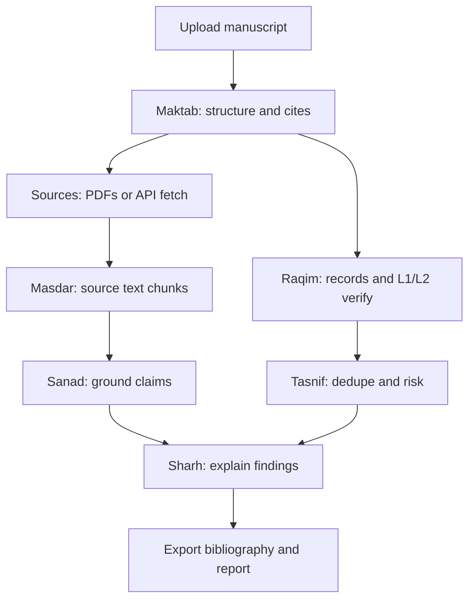

# Nassila — product brief

Audience-facing product definition for Ouroboros. Design tokens: [`DESIGN.md`](./DESIGN.md). Brand voice: [`BRAND.md`](./BRAND.md). Agent brief: [`OUROBOROS_CONTEXT.md`](./OUROBOROS_CONTEXT.md).

## Audience

Graduate students and researchers preparing a **submit-ready** thesis or manuscript. Primary need: trust that references are correct and that claims in the draft trace to sources. Bilingual EN/AR; RTL must feel native, not bolted on.

## Product promise

**Verify your references. Ground your claims.** Nassila is the last check before submission — bibliography quality, registry verification, and source-backed writing. AI assists; deterministic layers decide where schemas and registries are authoritative.

## Surface type

**Product** (desktop academic tool) — not a marketing site, not a generic SaaS dashboard. Dense information, calm hierarchy, keyboard-friendly tables, clear error states.

## Ouroboros, not Hydra

**Ouroboros** is one continuous academic loop. **Hydra** is the failure mode: seven disconnected “heads” the user must visit, copy between, and mentally wire together.

| Ouroboros (ship) | Hydra (reject) |
|------------------|----------------|
| One manuscript audit journey | Seven equal peer tabs as the main product |
| Workers complete each other as stages | User pastes the same text into separate modules |
| Upload manuscript → resolve sources → audit → explain → export | Pick a worker and hope the rest catches up |
| Unfinished stages shown as pipeline gaps, not fake apps | Stubs that look like finished destinations |

Worker codenames (Raqim, Sanad, Maktab, …) remain **product vocabulary** and **engineering boundaries**. They are **not** the primary information architecture. The user-facing IA is the loop below.

## Primary IA: the Ouroboros loop

**User-facing modes:** **Manuscript** (integrated upload → sources → audit → export) and **Bibliography** (import, verify, export without a manuscript). *Ouroboros* remains the internal architecture name for the closed worker pipeline.

The intended main screen is a **single connected workflow**, not a worker picker:

1. **Upload manuscript** (top) — DOCX, PDF, or text; extract structure and in-text citations (**Maktab**).
2. **Cited sources** (bottom) — attach PDFs for cited papers **or** let the app resolve via Crossref / PubMed / OpenAlex and fetch open-access text where available (**Masdar** + **Raqim** L1/L2).
3. **Audit** — ground claims against source excerpts (**Sanad**); flag duplicates, predatory journals, and validation issues (**Tasnif**); surface table/figure evidence when Tier 3 ships (**Shahid**).
4. **Explain** — deterministic mismatch and risk copy today; richer narrative later (**Sharh**).
5. **Export** — corrected bibliography and audit summary (**Raqim** citeproc).

**Secondary mode:** bibliography-only work (import `.bib` / RIS, verify, export) without a manuscript — still **Raqim** + **Tasnif**, but not the primary Ouroboros entry.

## Workers as loop stages (not nav destinations)

Seven workers map to stages in the loop. Maturity varies; honest gaps only — no fake progress.

| Worker | Arabic | Loop stage | End-state role | Current scaffold |
|--------|--------|------------|----------------|------------------|
| **Maktab** | مكتب | Ingest | Manuscript upload and segmentation | Stub — required for Tier 3 loop |
| **Masdar** | مصدر | Sources | Cited-paper text (user PDF or OA fetch) | Stub — required for Tier 3 loop |
| **Sanad** | سند | Ground | Passage vs source excerpt → verdicts | Live manual paste (Tier 2 bridge) |
| **Shahid** | شاهد | Evidence | Tables and figures as evidence | Disabled — Tier 3+ |
| **Raqim** | رقيم | Records | Import, verify, export | Live — bibliography mode + loop feed |
| **Tasnif** | تصنيف | Risk | Dedupe, predatory, issue triage | Live — feeds loop + Raqim filters |
| **Sharh** | شرح | Explain | Issue and mismatch explanations | Partial — deterministic copy |

**Settings** holds LM Studio slots: `nassila-sanad-e4b` (default, **v1.12**), optional `nassila-sanad-12b` (**v1.14** quality tier). Run laptop smoke ([`LAPTOP_SMOKE_TEST.md`](https://github.com/jamalesam93/NassilaT/blob/main/training/LAPTOP_SMOKE_TEST.md)) on downloaded GGUFs before treating release as verified.

## Transitional UI (v1 reform scaffold)

The shipping app may still expose a **seven-item worker nav** from the first Ouroboros UI slice. Treat that as **transitional scaffolding**, not the end-state IA:

- **Do not** present unfinished workers as peer destinations when they are pipeline stages.
- **Do not** ask users to manually carry manuscript text from tab to tab.
- Manual **Sanad** passage + excerpt paste is a **Tier 2 / developer bridge** and model smoke path — not the final user journey.
- When the loop ships, Sanad consumes **Maktab** + **Masdar** outputs automatically; manual paste remains an advanced fallback only.

## Data flow today vs target

**Today (shipping scaffold):**

1. User opens **Manuscript** (default) or switches to **Bibliography** (Raqim).
2. In the loop: upload/paste manuscript → **Run audit** → L1/L2 per cite, OA/abstract fetch, L3 Sanad when Passage grounding is enabled.
3. **Tasnif** / **Sharh** copy appears inline in loop detail; bibliography drawer opens Raqim filters.
4. **Maktab**, **Masdar** (user PDF attach), and **Shahid** remain honest stubs — not separate peer tabs.
5. Engine applies JSON repair + quote-substring guardrails; LLM is advisory.

**Target (full Ouroboros):**

1. User uploads manuscript once; **Maktab** segments and **Masdar** ingests cited PDFs automatically.
2. **Sanad** runs per cite site without manual paste between modules.
3. **Sharh** / **Tasnif** / **Raqim** surface inline in the same audit session; export closes the loop.

## Voice

- Academic, precise, student-friendly (see `BRAND.md`).
- Say **AI-assisted**; never imply AI writes citations or replaces registry checks.
- Worker names are codenames in EN UI; Arabic labels in AR locale.

## Anti-references (do not ship)

- **Hydra IA** — seven equal worker tabs as the main product experience.
- Retired **Manuscript Audit** tab layout remounted as-is.
- Single undifferentiated “References” mega-tab hiding the loop forever.
- Generic AI SaaS patterns (see `DESIGN.md` Impeccable discipline).
- Shipping Sanad on **12B-only** without E4B default tier passing Tier 2.
- Stubs with fake progress bars or “coming soon” marketing chrome.

## Non-goals (v1 reform)

- Full reference manager replacement (Zotero/Mendeley).
- Open-ended thesis generation or drafting pillar.
- Cloud LLM as default; local LM Studio remains the Sanad path.
- Presenting the worker nav scaffold as the finished Ouroboros experience.

## Success criteria (product direction)

- Docs and future UI treat **Ouroboros loop** as primary IA; worker nav is secondary or advanced.
- Sanad wired to `nassila-sanad-e4b` (v1.12) / `nassila-sanad-12b` (v1.14) with Tier 2b guardrails (invalid quotes never show as pass).
- Raqim + Tasnif remain usable for bibliography-only users during transition.
- Copy states Tier 2 = abstract excerpts + manual bridge; Tier 3 = Maktab/Masdar in the app loop (full manuscript / cited-PDF audit).
- RTL parity; no AI-template UI tells per `DESIGN.md`.
