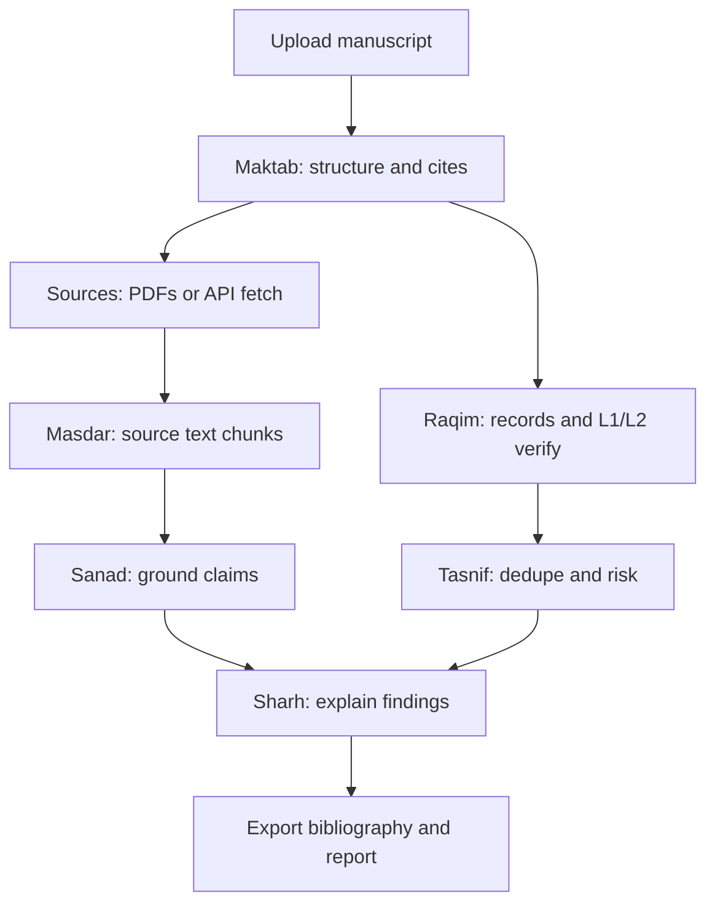

# Nassila — product brief

Audience-facing product definition for Ouroboros. Design tokens: [`DESIGN.md`](./DESIGN.md). Brand voice: [`BRAND.md`](./BRAND.md). Agent brief: [`OUROBOROS_CONTEXT.md`](./OUROBOROS_CONTEXT.md).

## Audience

Graduate students and researchers preparing a **submit-ready** thesis or manuscript. Primary need: trust that references are correct and that claims in the draft trace to sources. Bilingual EN/AR; RTL must feel native, not bolted on.

## Product promise

**Verify your references. Ground your claims.** Nassila is the last check before submission — bibliography quality, registry verification, and source-backed writing. AI assists; deterministic layers decide where schemas and registries are authoritative.

## Surface type

**Product** (desktop academic tool) — not a marketing site, not a generic SaaS dashboard. Dense information, calm hierarchy, keyboard-friendly tables, clear error states.

## Ouroboros, not Hydra

**Ouroboros** is one continuous academic loop. **Hydra** is the failure mode: seven disconnected “heads” the user must visit, copy between, and mentally wire together.

| Ouroboros (ship) | Hydra (reject) |
|------------------|----------------|
| One manuscript audit journey | Seven equal peer tabs as the main product |
| Workers complete each other as stages | User pastes the same text into separate modules |
| Upload manuscript → resolve sources → audit → explain → export | Pick a worker and hope the rest catches up |
| Unfinished stages shown as pipeline gaps, not fake apps | Stubs that look like finished destinations |

Worker codenames (Raqim, Sanad, Maktab, …) remain **product vocabulary** and **engineering boundaries**. They are **not** the primary information architecture. The user-facing IA is the loop below.

## Primary IA: the Ouroboros loop

**User-facing modes:** **Manuscript** (integrated upload → sources → audit → export) and **Bibliography** (import, verify, export without a manuscript). *Ouroboros* remains the internal architecture name for the closed worker pipeline.

The intended main screen is a **single connected workflow**, not a worker picker:

1. **Upload manuscript** (top) — DOCX, PDF, or text; extract structure and in-text citations (**Maktab**).
2. **Cited sources** (bottom) — resolve via Crossref / PubMed / OpenAlex and fetch open-access text where available (**Masdar-lite** + **Raqim** L1/L2). Per-reference local PDF attach re-grounds just that citation.
3. **Audit** — ground claims against source excerpts (**Sanad**); flag duplicates, predatory journals, and validation issues (**Tasnif**); surface table/figure evidence when Tier 3 ships (**Shahid**).
4. **Explain** — deterministic mismatch and risk copy today; richer narrative later (**Sharh**).
5. **Export** — corrected bibliography and audit summary (**Raqim** citeproc).

```mermaid
flowchart TD
  upload["Upload manuscript"] --> maktab["Maktab: structure and cites"]
  maktab --> sources["Sources: PDFs or API fetch"]
  sources --> masdar["Masdar: source text chunks"]
  maktab --> raqim["Raqim: records and L1/L2 verify"]
  raqim --> tasnif["Tasnif: dedupe and risk"]
  masdar --> sanad["Sanad: ground claims"]
  sanad --> sharh["Sharh: explain findings"]
  tasnif --> sharh
  sharh --> export["Export bibliography and report"]
```

**Secondary mode:** bibliography-only work (import `.bib` / RIS, verify, export) without a manuscript — still **Raqim** + **Tasnif**, but not the primary Ouroboros entry.

## Bibliography-first workflow (operator rule)

Manuscript audit parses the **embedded References section** inline. If that block is messy (wrong numbering, missing DOIs, bad plain-text parse, cite–ref mismatches), L1 and Sanad inherit the chaos.

**Recommended path when references are chaotic or unverified:**

1. Open **Bibliography** — import the reference list (DOCX, `.bib`, RIS, or paste).
2. **Verify** (L1/L2), autocorrect, dedupe, and attach missing DOIs in Raqim.
3. Return to **Manuscript** — **Send references to Bibliography** (or import manually), verify in Raqim, enable **Audit from Bibliography library**, then run audit.

The loop ships **export refs → Raqim** and **audit from Bibliography store** (numeric cite keys preserved via `manuscript-ref:N` ids). Author–year cites can match manually imported rows without export.

**Unpaywall email** (Settings → General) enables **open-access** full-text lookup only — not university paywall login. Subscription PDFs: attach when **Masdar** ships, or Tier 3 institutional access.

## Workers as loop stages (not nav destinations)

Seven workers map to stages in the loop. Maturity varies; honest gaps only — no fake progress.

| Worker | Arabic | Loop stage | End-state role | Current status |
|--------|--------|------------|----------------|----------------|
| **Maktab** | مكتب | Ingest | Manuscript upload and segmentation | **Deterministic live:** DOCX/text + pdf.js; Enhanced OCR (**eng/fra** bundled) for Latin scans; Arabic PDF OCR → **2.0.0** (native pdf-inspector + pretrained Arabic adapter); `doc_extract` LLM facet only if deterministic fails |
| **Masdar** | مصدر | Sources | Cited-paper text (user PDF or OA fetch) | **Deterministic live:** OA fetch + PDF extraction + per-reference local attach + folder scan; `source_pdf_extract` LLM facet planned |
| **Sanad** | سند | Ground | Passage vs source excerpt → verdicts | Live in loop (Tier 2 bridge + automated path); **9B FT-6/v119** sole Hub tier |
| **Shahid** | شاهد | Evidence | Tables and figures as evidence | Disabled — gated to **2.0.0** (did not ship in 1.8.0) |
| **Raqim** | رقيم | Records | Import, verify, export | Live — bibliography mode + loop feed |
| **Tasnif** | تصنيف | Risk | Dedupe, predatory, issue triage | Live — feeds loop + Raqim filters |
| **Sharh** | شرح | Explain | Issue and mismatch explanations | Partial — deterministic copy |

**Settings** holds the LM Studio slot: `nassila-sanad-9b` (**FT-6**, sole Sanad tier; 4B S15 / 12B S14 retired as abstract-era). Run laptop smoke ([`LAPTOP_SMOKE_TEST.md`](https://github.com/jamalesam93/NassilaT/blob/main/training/LAPTOP_SMOKE_TEST.md)) on downloaded GGUFs before treating release as verified.

## Shipping UI (loop vs bibliography)

**User-facing modes only:** **Manuscript** (Ouroboros loop) and **Bibliography** (Raqim). The old seven-item worker navigation is **gone** — do not restore Hydra peer tabs.

- Workers remain **loop stages and code modules**, not nav destinations.
- Manual **Sanad** passage + excerpt paste is a **Tier 2 / developer bridge** and model smoke path — not the final user journey.
- When sources attach, Sanad consumes **Maktab** + **Masdar** outputs automatically; manual paste remains an advanced fallback only.

## Data flow today vs target

**Today (shipping):**

1. User opens **Manuscript** (default) or switches to **Bibliography** (Raqim) — loop vs bibliography only.
2. In the loop: upload/paste manuscript → **Run audit** → L1/L2 per cite, OA/abstract fetch, L3 Sanad when Passage grounding is enabled.
3. **Tasnif** / **Sharh** copy appears inline in loop detail; bibliography drawer opens Raqim filters.
4. **Maktab** and **Masdar-lite** deterministic stages are live, including Masdar local-PDF attach and folder scan; their LLM facets remain planned. **Shahid** remains gated to **2.0.0** — not a peer tab.
5. Engine applies JSON repair + quote-substring guardrails; LLM is advisory.

**Target (full Ouroboros):**

1. User uploads manuscript once; **Maktab** segments and **Masdar** ingests cited PDFs automatically.
2. **Sanad** runs per cite site without manual paste between modules.
3. **Sharh** / **Tasnif** / **Raqim** surface inline in the same audit session; export closes the loop.

## Voice

- Academic, precise, student-friendly (see `BRAND.md`).
- Say **AI-assisted**; never imply AI writes citations or replaces registry checks.
- Worker names are codenames in EN UI; Arabic labels in AR locale.

## Anti-references (do not ship)

- **Hydra IA** — seven equal worker tabs as the main product experience (removed; do not restore).
- Retired **Manuscript Audit** tab layout remounted as-is.
- Single undifferentiated “References” mega-tab hiding the loop forever.
- Generic AI SaaS patterns (see `DESIGN.md` Impeccable discipline).
- Shipping Sanad without the sole **9B FT-6** Hub tier as default (4B/12B retired).
- Stubs with fake progress bars or “coming soon” marketing chrome.

## Non-goals (v1 reform)

- Full reference manager replacement (Zotero/Mendeley).
- Open-ended thesis generation or drafting pillar.
- Cloud LLM as default; local LM Studio remains the Sanad path.
- Restoring seven-worker navigation as the finished Ouroboros experience.

## Success criteria (product direction)

- Docs and UI treat **Ouroboros loop** as primary IA; bibliography is the second mode only.
- Sanad wired to `nassila-sanad-9b` (FT-6 on Hub) with Tier 2b guardrails (invalid quotes never show as pass).
- Raqim + Tasnif remain usable for bibliography-only users.
- Copy distinguishes live deterministic Maktab/Masdar-lite (including local-PDF attach) from planned LLM facets; Tier 3 / **2.0.0** adds evaluated full-text + Shahid evidence.
- RTL parity; no AI-template UI tells per `DESIGN.md`.
